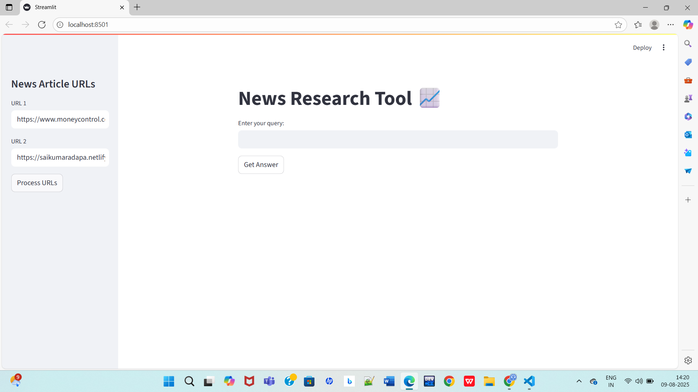
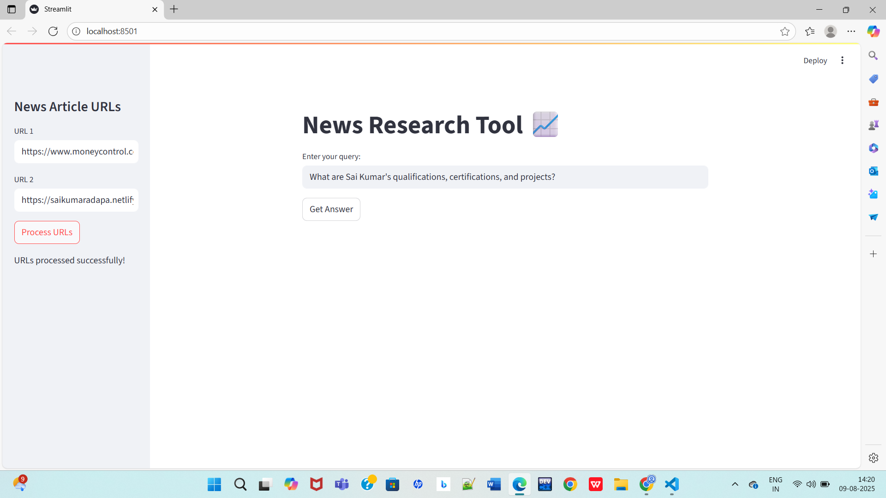
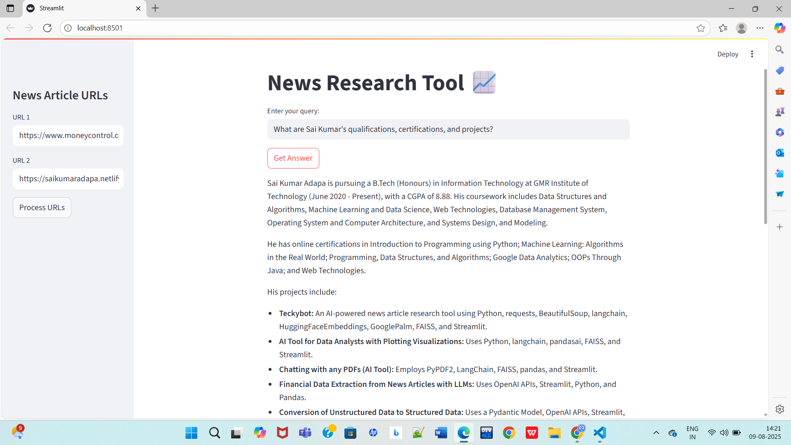

# 🌐 RAG Application for Real Websites with URLs

An interactive Retrieval-Augmented Generation (RAG) application that extracts real-time content from live websites, stores it locally, and answers user queries only based on the extracted content using Google's Gemini API — all via a user-friendly Streamlit interface.

---

## 📁 Project Structure
```
RAG_application_for_real_websites_with_urls/
├── assets/
│   ├── Screenshot1.png                     # URL input sidebar
│   ├── Screenshot2.png                     # Process input urls
│   ├── Screenshot3.png                     # Query input box
│   ├── Screenshot4.png                     # Generated answer output
├── notebooks/
│   └── RAG_application_for_real_websites_with_urls.ipynb   # Development notebook
├── src/
│   └── app.py                               # Main Streamlit application
├── .env                                     # Environment variables (API key)
├── .gitignore                               # Git ignore file
├── extracted_data.txt                       # Saved extracted website text
├── LICENSE                                  # License file
├── README.md                                # Project documentation
├── requirements.txt                         # Python dependencies
```

---

## ✅ Project Objective

- **Goal:** Fetch and store text from real websites and answer natural language queries based only on that extracted content.
- **Pipeline:** Website URLs ➜ HTML scraping ➜ Text extraction ➜ Context storage ➜ LLM-powered Q&A via Gemini API.

---

## ⚙️ Tech Stack

- **Language:** Python 3.x  
- **Libraries:** **requests –** HTTP requests for fetching websites
                 **beautifulsoup4 –** HTML parsing and text extraction
                 **streamlit –** Web UI for interaction
                 **python-dotenv –** Environment variable management
                 **google-generativeai –** Google Gemini API for text generation
- **Deployment:** Local Streamlit server

---


## 🚀 How to Run Locally

### 1️⃣ Clone the Repo
```bash
git clone https://github.com/SivaTeja074/RAG_application_for_real_websites_with_urls.git
cd RAG_application_for_real_websites_with_urls
```

### 2️⃣ Install Dependencies
```bash
pip install -r requirements.txt
```

### 3️⃣ Set Up Environment Variables
```bash
Create a .env file in the root folder and add:
GOOGLE_API_KEY=your_google_api_key_here
```

### 4️⃣ Run the Streamlit App
```bash
streamlit run src/app.py
```

Open `http://localhost:8501` in your browser ✅

---

## 🖼️ Screenshots

### 🎯 URL input sidebar 


### 🎯 Process input urls  


### 🎯 Query input box


### 🎯 Generated answer output


---

## 📈 Features

- ✅ Fetch content from any real website. 
- ✅ Store extracted text in extracted_data.txt.
- ✅ Answer user queries only based on stored context. 
- ✅ Simple and interactive UI with Streamlit. 
- ✅ Uses Gemini 1.5 Flash for fast and accurate responses.  

---

## 🔮 Future Scope

- Add multiple website support with dynamic input size.
- Store and manage multiple extraction sessions.
- Integrate vector database for semantic search.
- Deploy to Streamlit Cloud or Render for public access.

---

## 📚 References

- Google Generative AI Python SDK Docs
- BeautifulSoup Documentation
- Streamlit Documentation

---

## 📜 License

This project is licensed under the [MIT License](LICENSE).

---

## 👨‍💻 Author

**Siva Teja Talari**  
[GitHub](https://github.com/SivaTeja074)

---

## ⭐ Contributions

Contributions, issues, and feature requests are welcome!  
Feel free to ⭐ the repo.
